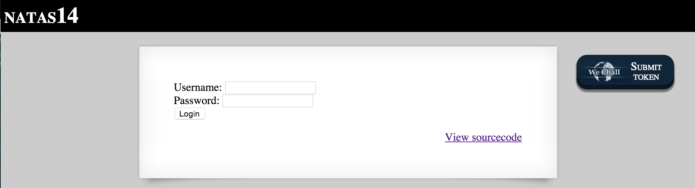
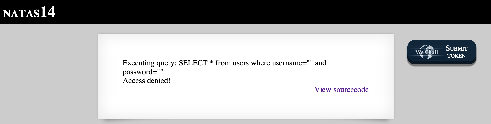
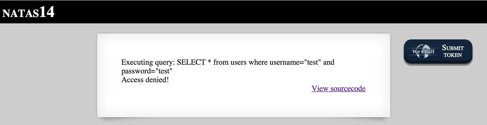
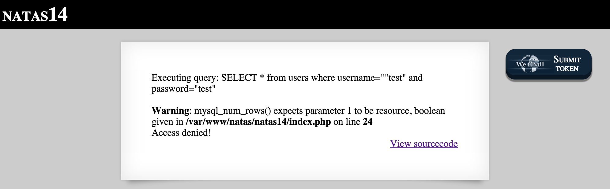
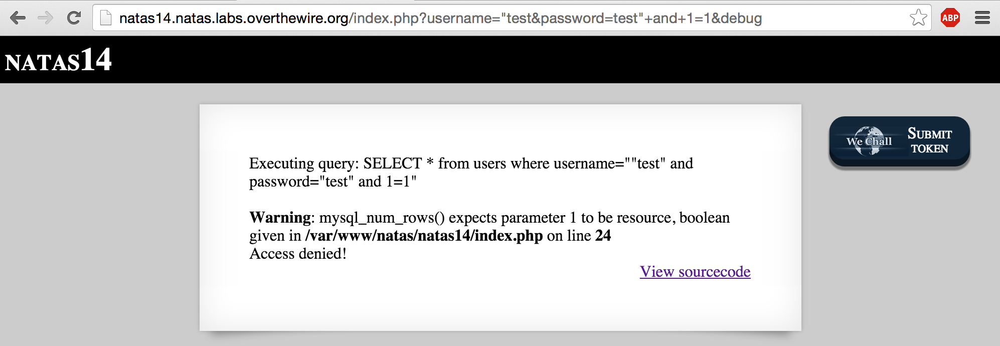
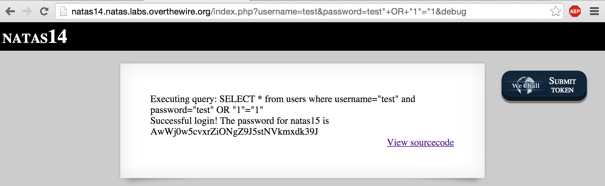

# NATAS 14



NATAS 14 presents you with a login form and yet again provides you with a link to view the PHP script that processes form submissions.

This page was specifically crafted for this challenge to let you see the script that runs on the server.  Normally, you wouldn't be able to view PHP on the client unless something was misconfigured or it was intentionally displayed.

```php
<?
if(array_key_exists("username", $_REQUEST)) {
    $link = mysql_connect('localhost', 'natas14', '<censored>');
    mysql_select_db('natas14', $link);

    $query = "SELECT * from users where username=\"".$_REQUEST["username"]."\" and password=\"".$_REQUEST["password"]."\"";
    if(array_key_exists("debug", $_GET)) {
        echo "Executing query: $query<br>";
    }

    if(mysql_num_rows(mysql_query($query, $link)) > 0) {
            echo "Successful login! The password for natas15 is <censored><br>";
    } else {
            echo "Access denied!<br>";
    }
    mysql_close($link);
} else {
?>
```
First of all, if you're not familiar with PHP, it always helps to look these functions up in the official documentation at http://php.net/manual/en/.  You'll need to be familiar with the predefined variable [$_REQUEST]( http://php.net/manual/en/reserved.variables.request.php ), [array_key_exists]( http://php.net/manual/en/function.array-key-exists.php ), and [mysql_num_rows]( http://php.net/manual/en/function.mysql-num-rows.php ) .  

Just by looking at the $query string (if you are familiar with PHP or web application security), we can tell two things:

a) the username and password input isn't properly sanitized from SQL Injections

b) the script is getting input from the [$_REQUEST]( http://php.net/manual/en/reserved.variables.request.php ) array which allows user input from both HTTP POST, HTTP GET, or Cookies

While it's perfectly possible to solve this challenge by using the form provided on the page, the following line of code has an if statement that checks for a debug parameter in the HTTP GET array.  Lets see how useful an echo of the $query string can be...

To do this, your url should start with the following structure:


If you hit enter with the url above using those blank parameters, the page result looks like this:


Okay so the debug parameter is going to be useful for showing us what SQL query is sent to the database.  Let's add some test parameters:


Hitting enter, we get the following page:



Most SQL Injections require escaping quotations, so lets see what happens if we introduce an extra quote into the username:


Now we see an error:



Besides the fact that the website administrator "forgot" to disable PHP error_reporting, we can tell that by introducing an extra quotation into the username parameter, we were able to cause an error in the SQL Query (the quotations aren't lining up).

A common technique is to provide the DBMS with a query that always evaluates to true:


However, you can see that we still need to escape the quotations from the password field.  Let's try it again:



Almost, but we still haven't escaped the closing quotation.  In order to do that, we'll have to use it as the closing quotation for our truth condition (1=1):


